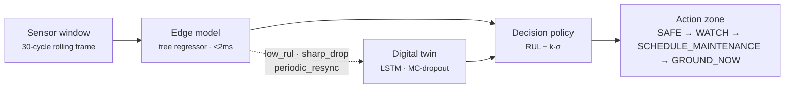

# Twin Turbo

A hybrid edge-intelligence / digital-twin framework for autonomous decision systems, built end-to-end on NASA's C-MAPSS turbofan engine degradation dataset.

A cheap model runs on every cycle. A higher-fidelity twin is invoked only when it's actually needed. A fixed policy turns whichever estimate is live into one of four actions — with zero human in the loop.

```
edge model   →  runs every cycle, <2ms, no uncertainty
digital twin →  runs on escalation, LSTM + MC-dropout, reports uncertainty
policy       →  RUL − k·σ  →  SAFE · WATCH · SCHEDULE_MAINTENANCE · GROUND_NOW
```

Simulated across all 690 held-out test engines: **zero late `GROUND_NOW` calls**, **82–87% of cycles never touch the twin**.

---

## The dataset

[NASA C-MAPSS](https://www.nasa.gov/intelligent-systems-division/discovery-and-systems-health/pcoe/pcoe-data-set-repository/) (`CMAPSSData/`) simulates a fleet of turbofan engines run from healthy to failure under realistic sensor noise. Each row is one engine, one flight cycle:

```
unit id · cycle · operational setting 1–3 · sensor measurement 1–21
```

Training trajectories run all the way to failure. Test trajectories are **truncated** at an arbitrary earlier point, and the task is to predict Remaining Useful Life (RUL) — cycles left before failure — from the truncated signal alone. `RUL_FDxxx.txt` holds the ground truth used only for scoring test predictions, never seen by any model.

Four sub-datasets scale difficulty on two independent axes — how many flight conditions the engine operates under, and how many things can fail:

| Dataset | Regimes | Fault modes | Train engines | Test engines |
|---|---|---|---|---|
| FD001 | 1 (sea level) | 1 (HPC degradation) | 100 | 100 |
| FD002 | 6 | 1 (HPC degradation) | 260 | 259 |
| FD003 | 1 (sea level) | 2 (HPC + fan degradation) | 100 | 100 |
| FD004 | 6 | 2 (HPC + fan degradation) | 248 | 249 |

More regimes means the same raw sensor value means something different depending on flight condition — it has to be normalized per-regime before it's usable, which is most of why FD002/FD004 are the harder pair.

**Citation:** A. Saxena, K. Goebel, D. Simon, N. Eklund, *"Damage Propagation Modeling for Aircraft Engine Run-to-Failure Simulation,"* PHM08, Denver CO, 2008.

---

## Architecture



The edge model never decides anything on its own — it only proposes an estimate. The twin is expensive enough that it's only worth calling when a trigger actually fires. The policy always makes the final call, and it discounts the estimate by its own uncertainty before comparing it to a threshold, so higher twin uncertainty pushes the decision toward caution rather than optimism.

---

## Pipeline

| Phase | What it does | Where |
|---|---|---|
| **1 — Data** | Parse raw C-MAPSS text, cluster operating regimes (k-means on the 3 settings), drop near-zero-variance sensors, build piecewise-linear RUL labels, window into fixed-length sequences | `src/data_pipeline/`, `scripts/build_dataset.py` |
| **2 — Edge model** | `HistGradientBoostingRegressor` over window-summary features (last value, mean, std, trend per sensor) | `src/models/edge_model.py`, `src/models/features.py`, `scripts/train_edge_model.py` |
| **3 — Digital twin** | PyTorch LSTM over the raw window, MC-dropout for uncertainty, forward trajectory projection (what-if simulation to failure) | `src/models/twin_model.py`, `scripts/train_twin_model.py` |
| **4 — Hybrid decision** | Escalation triggers (low RUL / sharp drop / periodic resync) fuse edge + twin; a fixed policy classifies the action zone | `src/decision/`, `scripts/run_hybrid_decision.py` |

---

## Results

**Model accuracy** (test set, official RUL targets):

| Dataset | Edge RMSE | Twin RMSE | Twin σ (mean, MC-dropout) | Edge latency |
|---|---|---|---|---|
| FD001 | 11.96 | 13.36 | 5.07 | 0.87 ms |
| FD002 | 13.87 | 16.64 | 4.59 | 1.95 ms |
| FD003 | 12.05 | 13.98 | 4.73 | 1.96 ms |
| FD004 | 15.50 | 15.79 | 4.34 | 0.87 ms |

The twin trails the edge model everywhere on point accuracy — an LSTM has less inductive bias than hand-engineered slope/mean/std features for a signal this monotonic. That's fine: the twin's job in the hybrid loop is the uncertainty band and the trajectory projection, not raw RMSE.

**Hybrid decision loop**, simulated cycle-by-cycle over every held-out test engine:

| Dataset | Units simulated | Twin trigger rate | Compute saved vs. always-twin | Ground-now calls (in-time / late) |
|---|---|---|---|---|
| FD001 | 100 | 17.1% | 82.9% | 6 / **0** |
| FD002 | 253 | 18.0% | 82.0% | 32 / **0** |
| FD003 | 100 | 13.0% | 87.0% | 7 / **0** |
| FD004 | 237 | 14.4% | 85.6% | 18 / **0** |

Zero late calls anywhere — the policy never reported "fine" after an engine had actually run out of RUL. Most engines never trigger `GROUND_NOW` at all, which is expected: test trajectories are truncated well before failure for most of the fleet.

---

## Repo layout

```
Twin_turbo/
├── CMAPSSData/                 raw NASA C-MAPSS text files
├── src/
│   ├── config.py                dataset variants, columns, defaults
│   ├── data_pipeline/           parser · regime clustering · RUL labels · windowing
│   ├── models/                  edge model · twin model · window-summary features
│   ├── decision/                escalation triggers · action-zone policy
│   └── eval/                    RMSE + PHM08 scoring
├── scripts/
│   ├── build_dataset.py         phase 1 — raw text → windowed arrays
│   ├── train_edge_model.py      phase 2 — train + eval edge model
│   ├── train_twin_model.py      phase 3 — train + eval digital twin
│   └── run_hybrid_decision.py   phase 4 — full hybrid simulation
├── data/processed/              generated window arrays (gitignored, rebuildable)
├── artifacts/                   trained models + metrics (gitignored, rebuildable)
└── requirements.txt
```

---

## Running it

```bash
pip install -r requirements.txt

# phase 1 — build windowed arrays for all four variants
python scripts/build_dataset.py --dataset ALL

# phase 2 — edge model
python scripts/train_edge_model.py --dataset ALL

# phase 3 — digital twin
python scripts/train_twin_model.py --dataset FD001 --epochs 40

# phase 4 — hybrid decision simulation
python scripts/run_hybrid_decision.py --dataset ALL
# or inspect one engine's full cycle-by-cycle timeline:
python scripts/run_hybrid_decision.py --dataset FD001 --unit 34 --dump-timeline
```

Each script is independently runnable and reads/writes `data/processed/` and `artifacts/` — nothing needs to be re-run to inspect a later phase's output, as long as the phase before it has been run at least once.
